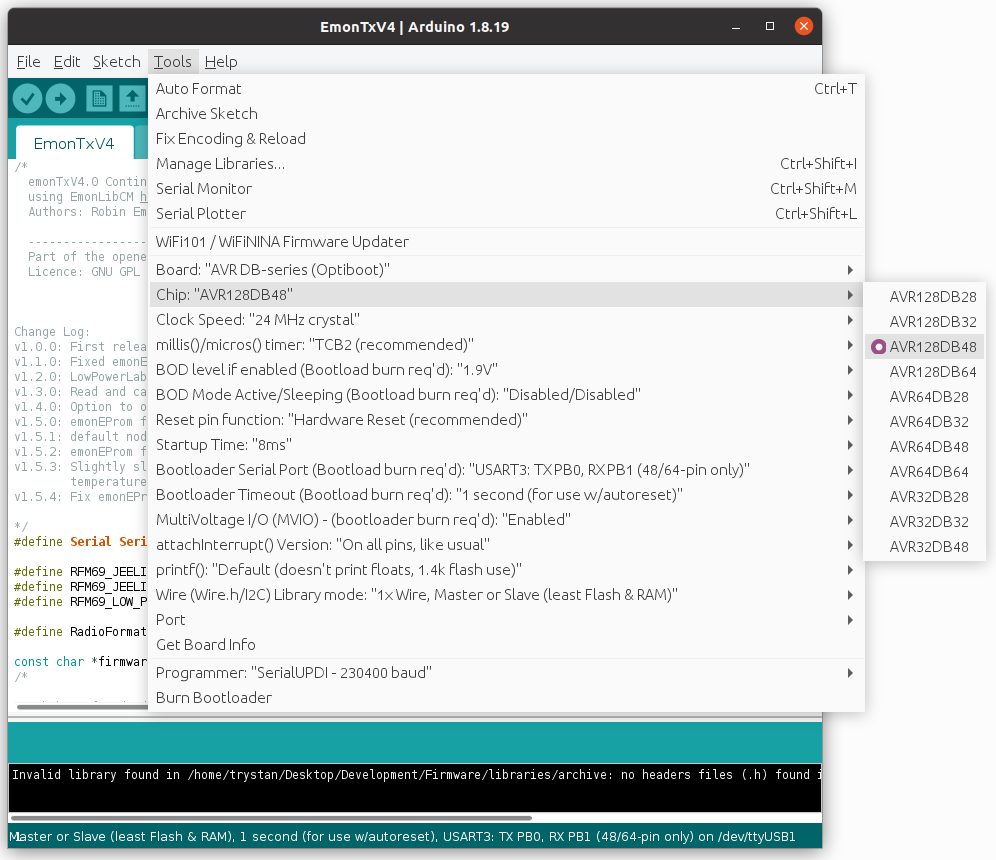

# Firmware

The emonPi2 firmware can be edited and compiled using [PlatformIO](https://platfomrio.org/) (recommended) or [Arduino IDE](https://www.arduino.cc/) with [DxCore installed](https://github.com/SpenceKonde/DxCore). DxCore is an Arduino core for the AVR-DB microcontroller range, developed by SpenceKonde.

## Available Firmware

**[EmonPi2_DB_6CT_1phase:](https://github.com/openenergymonitor/emonpi2/tree/main/firmware/EmonPi2_DB_6CT_1phase)** Single phase, 6 CT channel, continuous sampling using the new emonLibDB library, cumulative energy persisted to EEPROM, serial configuration and data output. *Temperature sensing and radio receiver handled by connected RaspberryPi.*<br>**Download:** [Pre-compiled hex](https://github.com/openenergymonitor/emonpi2/tree/main/firmware/EmonPi2_DB_6CT_1phase/compiled)

---

**[EmonPi2_DB_6CT_3phase:](https://github.com/openenergymonitor/emonpi2/tree/main/firmware/EmonPi2_DB_6CT_3phase)** Three phase, 6 CT channel, continuous sampling using the new emonLibDB library, cumulative energy persisted to EEPROM, serial configuration and data output. *Temperature sensing and radio receiver handled by connected RaspberryPi.*<br>**Download:** [Pre-compiled hex](https://github.com/openenergymonitor/emonpi2/tree/main/firmware/EmonPi2_DB_6CT_3phase/compiled)

---

**[EmonPi2_CM_3x_temperature_transmitter:](https://github.com/openenergymonitor/emonpi2/tree/main/firmware/EmonPi2_CM_3x_temperature_transmitter)** Designed for use when emonPi2 measurement board is used in standalone transmitter mode *IF* temperature sensing is required. Single phase, 6 CT channel, continuous sampling using the emonLibCM library, cumulative energy persisted to EEPROM, serial configuration and data output. *See [EmonTx4 DS18B20 Temperature sensing & firmware release 1.5.7](https://community.openenergymonitor.org/t/emonpi2-ds18b20-temperature-sensing-firmware-release-1-5-7/23496/2) for note on performance implications.*<br>**Download:** [Pre-compiled hex](https://github.com/openenergymonitor/emonpi2/tree/main/firmware/EmonPi2_CM_3x_temperature_transmitter/compiled)

---

**[EmonPi2_DB_6CT_1phase_with_analog:](https://github.com/openenergymonitor/emonpi2/tree/main/firmware/EmonPi2_DB_6CT_1phase_with_analog)** ANALOG INPUT ENABLED. Single phase, 6 CT channel, continuous sampling using the new emonLibDB library, cumulative energy persisted to EEPROM, serial configuration and data output. *Temperature sensing and radio receiver handled by connected RaspberryPi.*<br>**Download:** [Pre-compiled hex](https://github.com/openenergymonitor/emonpi2/tree/main/firmware/EmonPi2_DB_6CT_1phase_with_analog/compiled)

---

**[EmonPi2_DB_6CT_1phase_pulse_on_analog:](https://github.com/openenergymonitor/emonpi2/tree/main/firmware/EmonPi2_DB_6CT_1phase_pulse_on_analog)** Pulse input on analog input. Single phase, 6 CT channel, continuous sampling using the new emonLibDB library, cumulative energy persisted to EEPROM, serial configuration and data output. *Temperature sensing and radio receiver handled by connected RaspberryPi.*<br>**Download:** [Pre-compiled hex](https://github.com/openenergymonitor/emonpi2/tree/main/firmware/EmonPi2_DB_6CT_1phase_pulse_on_analog/compiled)

---

**[EmonPi2_CM_6CT_current_only:](https://github.com/openenergymonitor/emonpi2/tree/main/firmware/EmonPi2_CM_6CT_current_only)** 6 CT channel current only firmware for applications without a voltage sensor, continuous sampling using the new emonLibCB library, serial configuration and data output. *Temperature sensing and radio receiver handled by connected RaspberryPi.*<br>**Download:** [Pre-compiled hex](https://github.com/openenergymonitor/emonpi2/tree/main/firmware/EmonPi2_CM_6CT_current_only/compiled)

## Updating firmware

The easiest way of updating the emonPi2 firmware is to use the firmware upload tool.

1. In your local emonPi2 web interface, navigate to: `Setup > Admin > Update > Firmware`.
2. Select serial port `ttyAMA0` and then select `emonPi2` from hardware.
3. Select firmware variant as required.


## Upload pre-compiled using EmonScripts emonupload2 tool 

On the emonPi/emonBase ensure EmonScripts is updated to latest version then run emonupload2 tool 

    cd /opt/openenergymonitor/EmonScripts
    ./emonupload2.py

Select hardware then firmware version

```
Select hardware:
  1. emonPi2
  2. emonTx4
  3. emonPi
  4. emonTx3
  5. rfm69pi
  6. rfm12pi
  7. emonTH2
Enter number:1

Select firmware:
1. EmonPi2_DB_6CT_1phase                   1.0.2      (Standard LowPowerLabs)
2. EmonPi2_DB_6CT_3phase                   1.0.2      (Standard LowPowerLabs)
3. EmonPi2_CM_3x_temperature_transmitter   1.5.7      (Standard LowPowerLabs)

```

emonupload2 tool can also be run on any other linux computer by cloning the EmonScripts repo then running the emonupload2.py python script. Python3 required 

    git clone https://github.com/openenergymonitor/EmonScripts

## Upload pre-compiled manually using avrdude

Alternatively to upload the same pre-compiled firmware via command line on emonPi / emonBase: 

    avrdude -C/opt/openenergymonitor/EmonScripts/update/avrdude.conf -v -pavr128db48 -carduino -D -P/dev/ttyUSB0 -b115200 -Uflash:w:EmonPi2_DB_6CT_1phase_v1_0_2.ino.hex:i 

Or using different computer, ensure `avrdude.conf` has `avr128db48` entry i.e DxCore see below instructions 

    avrdude -Cavrdude.conf -v -pavr128db48 -carduino -D -P/dev/ttyUSB0 -b115200 -Uflash:w:EmonPi2_DB_6CT_1phase_v1_0_2.ino.hex:i 
    
You will need avrdude installed (tested on version 6.3-2017) and the custom DxCore avrdude.conf. This can be downloaded here: [DxCore avrdude.conf](https://raw.githubusercontent.com/openenergymonitor/emonpi2/main/firmware/avrdude.conf).

## How to compile and upload firmware

### Compile and Upload using PlatformIO (recommended)

Clone the emonTx V4 repo 

    git clone https://github.com/openenergymonitor/emonpi2
    cd emonpi2/firmware/EmonPi2_DB_6CT_1phase
    
Install PlatformIO core then to compile and upload  

    pio run -t upload

On first run PlatformIO will download automatically all the required libraries. You can also use the PlatformIO GUI. 

### Compile and Upload using Arduino IDE 

If you don’t already have the Arduino IDE it can be downloaded from here:<br>
[https://www.arduino.cc/en/software](https://www.arduino.cc/en/software)

Once you have the IDE installed, you then need to install [Spence Konde’s DxCore](https://github.com/SpenceKonde/DxCore). This can be done by first pasting the following board manager URL in Arduino IDE > File > Preferences:

    http://drazzy.com/package_drazzy.com_index.json

Then navigating to: *Tools > Boards > Boards Manager*, Select “DxCore by Spence Konde” and click Install. 


For more information on DxCore installation see: [https://github.com/SpenceKonde/DxCore/blob/master/Installation.md](https://github.com/SpenceKonde/DxCore/blob/master/Installation.md).

**Libraries**

Locate or create your Arduino Sketchbook directory (location found in Arduino preferences). If it doesnt already exist, create a directory called libraries in the Sketchbook directory and install the following libraries:


1\. Download EmonLibCM library (avrdb branch)<br>
[https://github.com/openenergymonitor/EmonLibCM/tree/avrdb](https://github.com/openenergymonitor/EmonLibCM/tree/avrdb)

2\. Download EmonLibDB library (main branch)<br>
[https://github.com/openenergymonitor/emonLibDB](https://github.com/openenergymonitor/emonLibDB)

2\. Download emonEProm library (avrdb branch)<br>
[https://github.com/openenergymonitor/emonEProm/tree/avrdb](https://github.com/openenergymonitor/emonEProm/tree/avrdb)

3\. Download RFM69_LPL library (main branch)<br>
[https://github.com/openenergymonitor/RFM69_LPL](https://github.com/openenergymonitor/RFM69_LPL)

4\. Download RFM69_JeeLib library (avrdb branch)<br>
[https://github.com/openenergymonitor/RFM69_JeeLib/tree/avrdb](https://github.com/openenergymonitor/RFM69_JeeLib/tree/avrdb)

5\. Download DxCore SpenceKonde OneWire library:<br>
[https://github.com/SpenceKonde/OneWire](https://github.com/SpenceKonde/OneWire)

**Compilation settings:**

With DxCore and the libraries installed the firmware should then compile. 

Under Tools, select the following configuration options:

- Select Board "AVR DB-series (Optiboot)"
- Select Chip: AVR128DB48
- Clock Speed: 24 MHz Crystal
- Bootloader serial port: UART3: TXPB0, RXPB1

Select Board "AVR DB-series (Optiboot)"


Select Chip: AVR128DB48



Bootloader serial port: UART3: TXPB0, RXPB1


